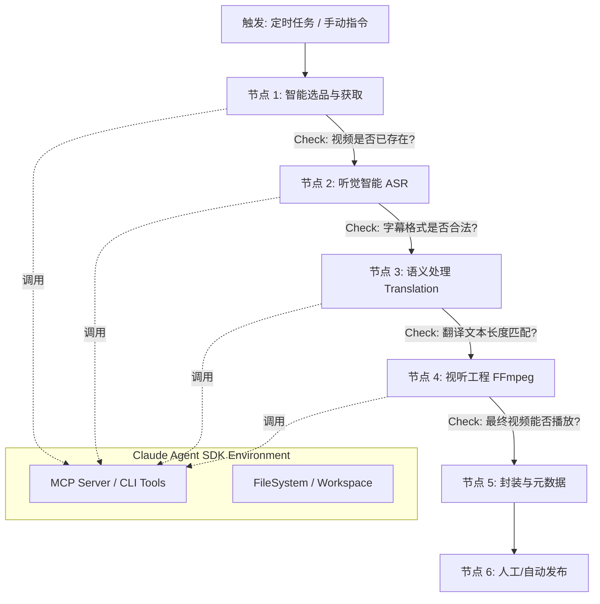

# Claude Agent 视频自动化流水线设计

## 1. 核心架构图 (Workflow Architecture)
本工作流采用 **Linear Chain with Feedback Loops**（带反馈的线性链）模式。Agent 不仅是执行者，更是每个节点的质量检查员。



---

## 2. 详细节点设计

### 节点 1: 智能选品与获取 (Smart Discovery & Ingestion)
**目标**：从互联网海量内容中精准捕获"高价值"视频（近期发布、数据表现好、来源可靠）。

**输入**：
- **Source A (白名单)**：预设高质量频道列表 (e.g., `@PeterSantonello`, `@SerpentZA`)
- **Source B (探索)**：核心关键词 (e.g., `"China EV Review"`, `"Shenzhen 4K Walk"`)

**Agent 动作 (双层漏斗机制)**：
1. **元数据侦察 (Metadata Scouting)**  
   - 使用工具获取视频列表 JSON 元数据
   - 命令：`yt-dlp --dump-json --flat-playlist --playlist-end 5 {url}`
   - 优势：仅需几秒获取标题/时长/播放量，不消耗流量

2. **LLM 审计 (Auditing)**  
   - 过滤条件：
     - 时长 < 60 秒的 Shorts
     - 播放量 < 10,000（除非是 1 小时内新发布）
     - 无关主题（基于标题识别）

3. **执行下载 (Ingestion)**  
   - 命令：`yt-dlp -f "bv*[ext=mp4]+ba[ext=m4a]/b[ext=mp4]" --write-comments --o "workspace/%(id)s/video.%(ext)s" {video_url}`

**工具集**：
```python
# 封装技能
def search_videos(query: str, limit: int = 5) -> List[VideoMeta]:
    """ytsearchN 封装，含过滤器"""
    return run_cli(f"yt-dlp --match-filter 'original_url!*=/shorts/ & duration > 120' --dump-json {query}")
```

**输出**：
- `workspace/{id}/video.mp4`
- `workspace/{id}/video.info.json` (含评论数据)

---

### 节点 2: 听觉智能 (Audio Intelligence)
**目标**：将音频转换为精确时间轴文本（SRT格式）。

**Agent 动作**：
1. 从视频剥离音频
2. 调用 `transcribe_audio_to_srt` 工具（基于 faster-whisper）
3. **关键策略**：使用 `large-v3` 模型保证识别精度

**工具集**：
- `ffmpeg_extract_audio`
- `whisper_local` (faster-whisper)

**输出**：`source_subs.srt`

---

### 节点 3: 语义处理 (Semantic Processing)
**目标**：将原文字幕翻译为中文并进行本地化润色。

**Agent 动作**：
1. 读取 `source_subs.srt`
2. 执行**思维链 (CoT) 策略**：
   - 识别专有名词
   - 决定技术术语/文化梗的翻译策略
   - 保持时间轴精准对齐
3. 严格保持 SRT 格式规范

**输出**：`translated_subs.srt`

---

### 节点 4: 视听工程 (Media Engineering)
**目标**：稳健完成字幕烧录与基础混音，确保产出可用。

**Agent 动作**：
1. **资源校验**：确认 `translated_subs.srt` 存在且非空
2. **字幕烧录 (Hardsub)**：
   - 使用 FFmpeg `subtitles` 滤镜
   - 指定中文字体路径（如 `SimHei.ttf`）防止乱码
3. **背景音合成**：
   - 从 `assets/bgm/` 选择通用 BGM
   - 用 `volume=0.1` 压低 BGM 音量
   - 用 `amix` 混合原声与 BGM

**工具集**：
```python
@tool
def render_standard_video(video_path: str, srt_path: str, bgm_path: str) -> str:
    """
    标准 MVP 渲染：烧录字幕 + 低音量 BGM
    返回最终视频路径
    """
    # FFmpeg 复杂滤镜封装
    filter_complex = (
        f"[0:v]subtitles='{srt_path}':force_style='Fontname=SimHei,FontSize=24'[v];"
        "[1:a]volume=0.1[bgm];[0:a][bgm]amix=inputs=2:duration=first[a]"
    )
    # 执行命令...
```

**输出**：`final_output.mp4`

---

### 节点 5: 封装与元数据 (Packaging)
**目标**：基于数据洞察生成高点击率元数据，制定封面策略。

#### 1. 数据源深度解析
Agent 从 `video.info.json` 提取字段：
| 字段 | 用途 | 处理策略 |
|------|------|----------|
| `title` | 语义理解 | **重写**（基于SEO/点击率逻辑）e.g., "Why EV is failing" → "电动车泡沫破裂？深度解析 EV 行业的至暗时刻" |
| `description` | 信息提取 | 提取关键点/时间轴/参考链接生成中文摘要 |
| `tags` | 分类 | 翻译高频标签保证基础分类准确 |
| `view_count`/`like_count` | 爆款识别 | 若 `view_count/subscriber_count > 5`，严格模仿原标题句式 |
| `upload_date` | 时效性 | 过滤搬运过时内容 |

#### 2. 封面策略
| 阶段 | 策略 | 优势 |
|------|------|------|
| **MVP (低成本)** | 1. FFmpeg 随机抽取3张高对比度帧2. 无文字遮挡时直接使用原缩略图 | 快速实施，零额外成本 |
| **Phase 2 (原生生成)** | 调用 Kolors/Flux.1 模型生成带中文标题的封面 | • 极简架构（单API调用）• 文字/画面光影融合自然• 成本低于 $0.01/张 |

**Prompt 模板**：
```prompt
High quality YouTube thumbnail style. 
The image features [SCENE: A broken Tesla in a snowy storm, cinematic lighting]. 
In the center, large bold text written in Chinese says: "[TEXT: 特斯拉趴窝]". 
Vibrant colors, high contrast, 4k resolution.
```

**输出**：
- `metadata.json` (含 title/description/tags)
- `thumbnail_final.jpg`

---

### 节点 6: 通知与交付 (Notification & Handoff)
**目标**：将产物交付人类创作者，**人工完成上传**（放弃 GUI 自动化）。

**决策依据**：
- 💰 **成本**：GUI 操作消耗大量 Token（截图+多步操作）
- 🛡️ **稳定性**：平台前端频繁更新导致脚本失效
- ⚠️ **风控**：自动化上传易触发机器人检测封号

**Agent 动作**：
1. 完整性校验：检查 `final_output.mp4`, `metadata.json`, `thumbnail_final.jpg`
2. 生成交付包：整理至 `workspace/{video_id}/dist/`
3. 发送通知：
   ```bash
   echo "✅ 任务完成！视频已生成于: $OUTPUT_PATH"
   open $OUTPUT_PATH  # macOS
   xdg-open $OUTPUT_PATH  # Linux
   ```

**输出**：终端通知/自动打开文件夹

---

## 3. 关键工具封装 (MCP/Skills 定义)

### Skill: `media_processor`
```python
@tool
def render_standard_video(video_path: str, srt_path: str, bgm_path: str) -> str:
    """标准 MVP 渲染：烧录字幕 + 低音量 BGM"""
    output_path = video_path.replace(".mp4", "_final.mp4")
    
    # 处理路径转义（Windows/Linux）
    srt_escaped = srt_path.replace('\\', '/').replace(':', '\\:')
    
    cmd = [
        "ffmpeg", "-y",
        "-i", video_path,
        "-stream_loop", "-1", "-i", bgm_path,  # 循环 BGM
        "-filter_complex", 
        f"[0:v]subtitles={srt_escaped}:force_style='Fontname=SimHei,FontSize=24'[v];"
        "[1:a]volume=0.1[bgm];[0:a][bgm]amix=inputs=2:duration=first[a]",
        "-map", "[v]", "-map", "[a]",
        "-c:v", "libx264", "-c:a", "aac",
        "-shortest",  # 以视频时长为准
        output_path
    ]
    subprocess.run(cmd, check=True)
    return output_path
```

### Skill: `subtitle_generator`
```python
@tool
def transcribe_audio_to_srt(audio_path: str, model_size: str = "large-v3") -> str:
    """使用 faster-whisper 生成 SRT 字幕"""
    model = WhisperModel(model_size, device="cuda", compute_type="float16")
    segments, _ = model.transcribe(audio_path, beam_size=5)
    
    output_path = f"{os.path.splitext(audio_path)[0]}.srt"
    
    with open(output_path, "w", encoding="utf-8") as f:
        for i, segment in enumerate(segments, 1):
            start = format_timestamp(segment.start)
            end = format_timestamp(segment.end)
            text = segment.text.strip()
            
            f.write(f"{i}\n{start} --> {end}\n{text}\n\n")
            
    return output_path

def format_timestamp(seconds: float) -> str:
    """转换为 SRT 时间戳格式 (HH:MM:SS,mmm)"""
    hours, remainder = divmod(seconds, 3600)
    minutes, seconds = divmod(remainder, 60)
    milliseconds = int((seconds - int(seconds)) * 1000)
    return f"{int(hours):02d}:{int(minutes):02d}:{int(seconds):02d},{milliseconds:03d}"
```

---

## 4. 扩展模块 (Future Roadmap: Phase 2)

### 模块 A: 病毒式开头生成器 (Viral Hook Engine)
**目标**：自动识别高光时刻并前置，提升完播率。

**技术方案**：
| 策略 | 实现方式 | 优势 |
|------|----------|------|
| **A (评论热力图)** | 正则提取评论时间戳，统计密度最高的10秒区间 | 基于真实用户兴趣 |
| **B (语义兜底)** | 当评论不足时，分析 SRT 文本的情绪强度（惊叹/转折） | 保证基础可行性 |

**预留技能**：
```python
@tool
def suggest_hook_timestamp(info_json_path: str) -> dict:
    """基于评论分析高光时刻"""
    with open(info_json_path) as f:
        data = json.load(f)
    
    # 提取时间戳 (e.g., "1:23" → 83秒)
    timestamps = []
    pattern = re.compile(r'(\d{1,2}):(\d{2})')
    
    for comment in data.get('comments', []):
        matches = pattern.findall(comment.get('text', ''))
        timestamps.extend([int(m[0])*60 + int(m[1]) for m in matches])
    
    # 聚合10秒区间
    if timestamps:
        bucket = Counter(t//10 for t in timestamps).most_common(1)[0][0]
        return {"found": True, "start": bucket*10, "end": bucket*10+10}
    
    return {"found": False, "reason": "No valid timestamps"}
```

---

## 5. 商业落地可行性 Checklist

| 风险点 | 优化方案 | 优先级 |
|--------|----------|--------|
| **Token 成本** | • SRT 分批处理• 元数据预过滤 | ⭐⭐⭐⭐ |
| **FFmpeg 容错** | • Docker 预装中文字体• 文件存在性校验 | ⭐⭐⭐⭐ |
| **平台风控** | • MVP 阶段坚持人工上传• 模拟人类操作间隔 | ⭐⭐⭐⭐⭐ |
| **翻译质量** | • 专有名词白名单• 人工抽样审核 | ⭐⭐⭐ |
| **BGM 版权** | • 使用免版税音乐库• 音量严格限制在0.1 | ⭐⭐⭐⭐ |